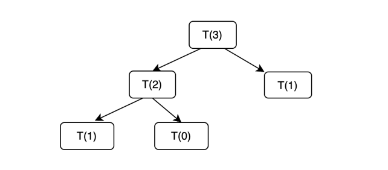
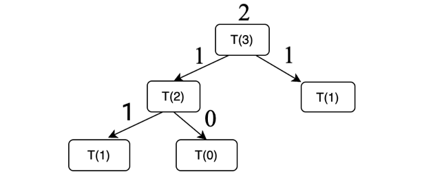
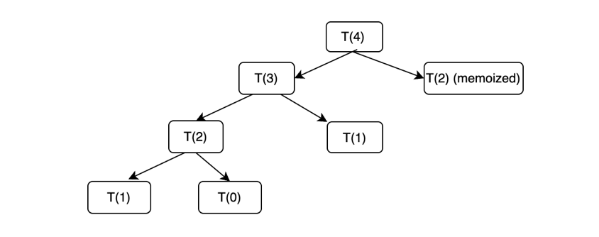
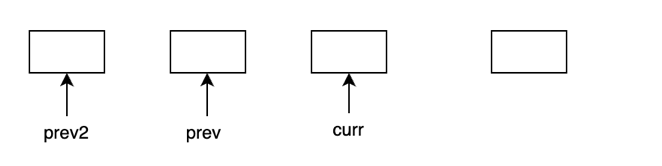
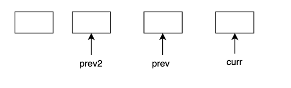

## Dynamic Programming is nothing to be scared of or worried about ##

Dynamic Programming is just recursion with caching i.e. caching the answers to the subproblems which are already solved.

There are two approaches for Dynamic Programming:

1. Tabulation (bottom up approach) : We start by solving the smallest subproblems first (the base cases) first. The answers to smaller subproblems are used to calculate the answers for bigger subproblems. (NOTE: There's a common misconception among people that tabulation means going from 0 to n to solve the subproblems, it is not always true, it depends upon the way the implementation is written).

2. Memoization (top down approach) : We start by decomposing the bigger problem into smaller subproblems, and recursively get the answers to these smaller subproblems. We use the answers to these subproblems to calculate the answer of the bigger problem. (NOTE: There's a common misconception among people that tabulation means going from n to 0 to solve the bigger problem, it is not always true, it depends upon the way the implementation is written).

Memoization is more intuitive to most people than directly writing tabulation.

Hence, the approach we'll be using for all the problems will be to :

1. Write the recursive solution for the problem. Discuss the tree diagram for the problem, and the time and space complexity of the solution.

2. Memoize the recursive solution. Again discuss the time and space complexity of the solution.

3. Convert the memoization solution to tabulation, with the help of some steps. Discuss the time and space complexity of the solution.

4. Look towards the possibility of space optimizing the solution. If possible, discuss and write the space optimized solution, along with the time and space complexity of the solution.

The first problem that we want to solve is the, Fibonacci number problem : 


```
The Fibonacci numbers, commonly denoted F(n) form a sequence, called the Fibonacci sequence, such that each number is the sum of the two preceding ones, starting from 0 and 1. That is,

F(0) = 0, F(1) = 1
F(n) = F(n - 1) + F(n - 2), for n > 1.
```

LeetCode Link: [Fibonacci Number](https://leetcode.com/problems/fibonacci-number/)

Recursive solution: 

```
int fib(int n) {
    if (n==0 || n==1) return n;
    return fib(n-1)+fib(n-2);
}
```

Time complexity of recursive solution is expected be to exponential. Let's explore using iterative method :


```
T(n) = T(n-1) + T(n-2) + a  

For simplicity in calculation, we can assume T(n-1) = T(n-2)

Hence, T(n) = 2*T(n-1) + a       ---> 1

T(n-1) = 2* T(n-2) + a           ---> 2

Substituting 2 in 1, we have

T(n) =  4 * T(n-2) + 3 * a       ---> 3

T(n-2) = 2 * T(n-3) + a          ---> 4

Putting 4 in 3, we have 

T(n) = 8 * T(n-3) + 7 * a        ---> 5

So the recursive pattern from 1, 3 and 5 turns out to be, 

T(n) = 2^k * T(n-k) +  (2^k -1 ) * a ---> 6

Putting k=n, we have ,

T(n) = 2^(n) * T(0) + (2^n-1) * a which is exponential in nature
```

The tree diagram for the problem is:



The space complexity of the problem is O(n) due to auxiliary recursive stack space. At a moment, a maximum of n recursive stack frames can be in the memory.

**Dry run for n=3**



**Memoization**

If we take a look at the recursive tree diagram above, we can observe that there are overlapping subproblems. Hence, we can memoize the answers to these subproblems and optimize the time complexity. 

```
int help(int n,vector <int> &dp){
    if (n==0 || n==1) return n;
    if (dp[n]!=-1) return dp[n];
    return dp[n]=help(n-1,dp)+help(n-2,dp);
}
int fib(int n) {
    vector <int> dp(n+1,-1);
    return help(n,dp);
}
```

Tree diagram: 



The time complexity of this solution is O(n) , as there are a maximum of n unique states of dp.

The space complexity of this solution is O(n) as the dp array is of size n, and also there is recursive stack space of size n.

## Let's now discuss how we can convert a memoization solution to tabulation solution ##

There's a four step process for this :

1. Initialize a dp vector or table of appropriate dimensions. Populate the base cases in the dp vector or table.

2. Identify the recursive changing parameters and their direction. As an example, a recursive parameter i might go from n to 0.

3. Write loops and reverse the direction of recursive parameters in the loops.

4. Copy the recursive code and change the recursive calls in the memoized code to dp vector or table. 

Tabulation code: 

```
int fib(int n) {
    if (n==0) return 0;
    vector <int> dp(n+1);
    dp[0]=0;
    dp[1]=1;
    for (int i=2;i<=n;i++){
        dp[i]=dp[i-1]+dp[i-2];
    }
    return dp[n];
}
```

Time complexity of this approach: O(N) as we are using a loop with n iterations.

Space complexity: O(N) for the dp vector

**Space optimization**

Let's look if we can optimize the space for iterative solution. If we take a look closely, the answer to dp state i depends on state i-1 and state i-2, so at any given moment of time, we only need the answers to these two states, and not the entire dp vector itself. Hence, we can optimize the space by storing the answer to the previous two states.

```
int fib(int n) {
    if (n==0 || n==1) return n;
    int prev_2=0;
    int prev=1;
    int curr=0;
    for (int i=2;i<=n;i++){
        curr=prev+prev_2;
        prev_2=prev; //move the pointers
        prev=curr; //move the pointers
    }
    return curr;
}
```

Time complexity: O(n) as we are using a loop with n iterations

Space complexity: O(1) as only three variables are being used here.

See this diagram for movement of pointers:

Before:



After: 

