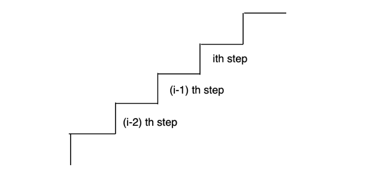

The problem for this session is Climbing stairs.

```
You are climbing a staircase. It takes n steps to reach the top.

Each time you can either climb 1 or 2 steps. In how many distinct ways can you climb to the top?
```

[LeetCode Link](https://leetcode.com/problems/climbing-stairs/description/)



Before discussing the solution to this problem, let's learn how we can identify whether a problem is a DP problem or not: We know that recursion is the root of DP. So, whenever we have any problem where we need to find out total number of ways to do a task, or find out the maximum/minimum/most optimal way to do some task out of many different possibilities, we use recursion as recursion explores all the possibilites. DP can be at times clubbed with recursion to store the answers to subproblems.

After identifying that the problem is a DP problem, we can use the following steps to formulate the recurrence:

1. Try to formulate the problem in terms of index (for 1D vector problems) or coordinates (for 2D matrix problems).

2. Do all the possible operations on that index/coordinate using recursion according to the problem statement.

3. If the question asks to count all possible ways : sum up the answers to all subproblems

If the question asks to find maximum/minimum of all possible ways: return the maximum/minimum answer of all subproblems

Let's see how we can formulate this problem into a recursive solution:

Let's say the state f(i) represents the total number of ways to reach the ith step of the stair. Now think that how could we reach this ith cell, when we are only allowed to take steps of 1 or 2. The answer is that we can only reach the ith step, from the (i-1)th step or the (i-2)th step. Hence, if the total number of ways to reach the (i-1)th step is x, and the total number of ways to reach the (i-2)th step is y, then I can conclude that the total number of ways to reach the ith step would be x+y .

Hence, the recurrence is:

```
f(i) = f(i-1) + f(i-2)
```

The base cases for this recurrence would be for i==1, if we only have 1 step in the stair, we only have 1 way to reach the top of the stair. Similarly for i==0, if we have 0 steps in the stairs, we have 1 way to reach the top of the stair (i.e. by not taking any step)

Recursive solution:

```
if (n==0 || n==1) return 1;
return climbStairs(n-1)+climbStairs(n-2);
```

Tree diagram for recursive solution:


Time complexity: Exponential in nature, as for each state, we are making two different recursive calls. 

Mathematical Proof of time complexity: 

```
T(N) = T(N-1) + T(N-2) + c

for simplicity, we can assume that T(n-1) = T(n-2)

Hence, the expression reduces to 

T(N) = 2 * T(N-1) + c       ---> 1

T(N-1) = 2 * T(N-2) + c     ---> 2

By substituting 2 in 1, we get

T(N) = 4 * T(N-2) + 3 * c   ---> 3

T(N-2) = 2 * T(N-3) + c     ---> 4

Putting 4 in 3
 
T(N) = 8 * T(N-3) + 7 * c   ---> 5

Hence, from equations 1,3 and 5 we can conclude that the recurrence is of the form :

T(N) = 2^k * T (N-k) + (2^k -1 ) * c

Putting k=n, we have 

T(n) = 2^n * T(0) + (2^n -1) * c which is 

T(n) = 2^n + (2^n-1) * c which is exponential in nature.
```

Space complexity for recursive solution: O(N) due to the auxiliary stack space. At any given moment of time, a maximum of n recursive stack frames can be in the memory.

**Memoization**

As we can see from the recursive tree diagram above, there are overlapping subproblems. We can memoize the answers to these subproblems, and reduce the time complexity of the code.

```
 int help(int n,vector <int> &dp){
    if (n==0 || n==1) return 1;
    if (dp[n]!=-1) return dp[n];
    return dp[n] = help(n-1,dp)+help(n-2,dp);
}
     
int climbStairs(int n) {
    vector <int> dp(n+1,-1);
    return help(n,dp);
}
```

Tree diagram for memoization : 


Time complexity: O(N) as there are n unique states in the dp, and every state is explored exactly once.

Space complexity: O(N) for the dp vector, and O(N) for recursive auxiliary stack space.

**Tabulation**

Following the four steps of converting memoized code to tabulation (which we discussed in the first lecture), we can write the bottom up tabulation code as :

```
int climbStairs(int n) {
    vector <int> dp(n+1);
    dp[0]=1;
    dp[1]=1;
    for (int i=2;i<=n;i++){
        dp[i] = dp[i-1]+dp[i-2];
    }
    return dp[n];
}
```

Time complexity: O(N) as we are using a loop with n iterations.

Space complexity: O(N) as we are using the dp vector with size N.

**Space optimization**

If we carefully look at the recurrence, we can observe that the dp state i depends only on the states i-1 and i-2. Hence, we can optimize the space by only keeping a track of these states, instead of storing the entire dp vector.

Here's the space optimized code:

```
if (n==1) return 1;
    int prev2=1;
    int prev1=1;
    int curr=0;
    for (int i=2;i<=n;i++){
        curr = prev2+prev1;
        prev2 = prev1;
        prev1 = curr;
    }
return curr;
```

Time complexity: O(N) as we are using a loop with n iterations.

Space complexity: O(1) as we are only using three variables.

If the constraints for this problem are too high, (like 1e18), we can solve the recurrence using Matrix exponentiation which will solve the problem in O(log N) time complexity. See the submission [here](https://www.geeksforgeeks.org/problems/matrix-exponentiation2711/1) for details.