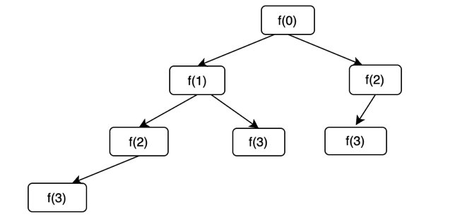
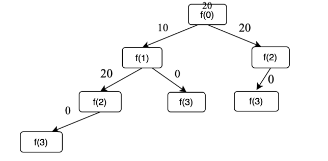
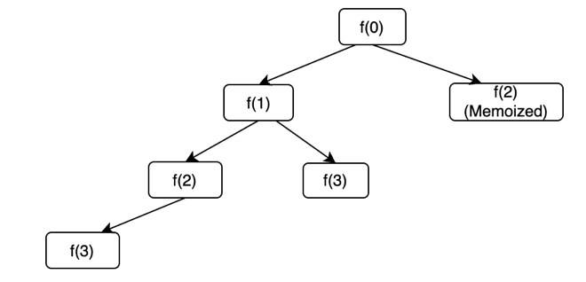

The third problem that we have in the DP series is Frog Jump.

```
There is a frog on the '1st' step of an 'N' stairs long staircase. The frog wants to reach the 'Nth' stair. 'HEIGHT[i]' is the height of the '(i+1)th' stair.If Frog jumps from 'ith' to 'jth' stair, the energy lost in the jump is given by absolute value of ( HEIGHT[i-1] - HEIGHT[j-1] ). If the Frog is on 'ith' staircase, he can jump either to '(i+1)th' stair or to '(i+2)th' stair. Your task is to find the minimum total energy used by the frog to reach from '1st' stair to 'Nth' stair.

For Example
If the given ‘HEIGHT’ array is [10,20,30,10], the answer 20 as the frog can jump from 1st stair to 2nd stair (|20-10| = 10 energy lost) and then a jump from 2nd stair to last stair (|10-20| = 10 energy lost). So, the total energy lost is 20.
```

Here's the problem link: [Frog Jump](https://www.codingninjas.com/studio/problems/frog-jump_3621012)

Let's formulate the solution to this problem recursively:

Let f(i) represent the total cost to reach the nth step (the final destination) from the ith step. Now, standing at the ith step, I only have two options: either to jump to the step (i+1) or to jump to the step (i+2). Hence, I explore both of these options.

Here's the code for recursive approach:

```
int help(int ind,int n,vector <int> &heights){
    if (ind==n-1) return 0;
    int firstJump=INT_MAX;
    int secondJump=INT_MAX;
    if (ind+1<=n-1){
        firstJump= abs(heights[ind+1]-heights[ind])+help(ind+1,n,heights);
    }
     if (ind+2<=n-1){
        secondJump= abs(heights[ind+2]-heights[ind])+help(ind+2,n,heights);
    }
    return min(firstJump,secondJump);
}
```

Here's the recursive tree diagram for n=4



Time complexity: Since at each state we are making recursive calls to two different states, the time complexity will be exponential in nature.

Mathematical proof for time complexity: If we look at the problem backwards, we can say that the recurrence can be formulated as : T(n) = T(n-1)+T(n-2)+c 

```
T(N) = T(N-1) + T(N-2) + c

for simplicity, we can assume that T(n-1) = T(n-2)

Hence, the expression reduces to 

T(N) = 2 * T(N-1) + c       ---> 1

T(N-1) = 2 * T(N-2) + c     ---> 2

By substituting 2 in 1, we get

T(N) = 4 * T(N-2) + 3 * c   ---> 3

T(N-2) = 2 * T(N-3) + c     ---> 4

Putting 4 in 3
 
T(N) = 8 * T(N-3) + 7 * c   ---> 5

Hence, from equations 1,3 and 5 we can conclude that the recurrence is of the form :

T(N) = 2^k * T (N-k) + (2^k -1 ) * c

Putting k=n, we have 

T(n) = 2^n * T(0) + (2^n -1) * c which is 

T(n) = 2^n + (2^n-1) * c which is exponential in nature.
```

Space complexity for recursive solution: O(N) due to the auxiliary stack space. At any given moment of time, a maximum of n recursive stack frames can be in the memory.

**Dry run**

Let's dry run on the test case: `10 20 30 10` , the answer to this problem is 20, as the frog can jump from 1st stair to 2nd stair (|20-10| = 10 energy lost).  Then a jump from the 2nd stair to the last stair (|10-20| = 10 energy lost). So, the total energy lost is 20 which is the minimum. 



**Memoized solution**

```
if (ind==n-1) return 0;
if (dp[ind]!=-1) return dp[ind];
int firstJump=INT_MAX;
int secondJump=INT_MAX;
if (ind+1<=n-1){
    firstJump= abs(heights[ind+1]-heights[ind])+help(ind+1,n,heights,dp);
}
if (ind+2<=n-1){
    secondJump= abs(heights[ind+2]-heights[ind])+help(ind+2,n,heights,dp);
}
return dp[ind]=min(firstJump,secondJump);
```

Recursive tree diagram for memoization based solution:



Time complexity of the memoized solution: O(N) as there a maximum of n unique states in the dp.

Space complexity: O(N) for dp vector and O(N) for recursive stack space

**Tabulation code**

We can convert the memoization solution into tabulation, by following the four steps discussed in the first lecture. Here's the code using tabulation:

```
for (int ind=n-2;ind>=0;ind--){
    int firstJump=INT_MAX;
    int secondJump=INT_MAX;
    if (ind + 1 <= n - 1) {
      firstJump = abs(heights[ind + 1] - heights[ind]) + dp[ind + 1];
    }
    if (ind+2<=n-1){
        secondJump= abs(heights[ind+2]-heights[ind])+dp[ind+2];
    }
    dp[ind]=min(firstJump,secondJump);
}
```

Time complexity: O(N) as there's a loop which runs for n iterations.

Space complexity: O(N) as we are using a dp vector of size n

**Space optimization**

Let's look towards space optimization. For every dp state i, we are using the answers to states (i+1) and (i+2) only. Hence, we can optimize the dp vector to use only two variables instead of storing the entire dp vector.

```
if (n==1) return 0;
if (n==2) return abs(heights[n-2]-heights[n-1]);
int after2=0;
int after1=abs(heights[n-2]-heights[n-1]);
int curr=INT_MAX;
for (int ind=n-3;ind>=0;ind--){
int firstJump=INT_MAX;
int secondJump=INT_MAX;
if (ind + 1 <= n - 1) {
    firstJump = abs(heights[ind + 1] - heights[ind]) + after1;
}
if (ind + 2 <= n - 1 ){
    secondJump= abs(heights[ind+2]-heights[ind])+ after2;
}
after2 = after1;
curr = min(firstJump,secondJump);
after1 = curr;
}
return curr;
```

Time complexity of this approach: O(N) as we are using a loop with n iterations

Space complexity: O(1) as we just using three variables