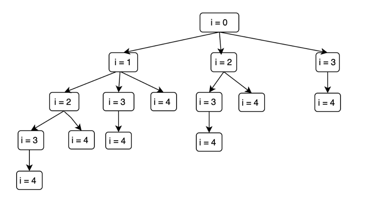
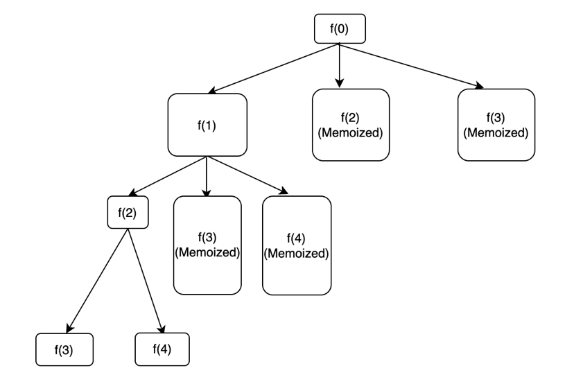

The problem that we'll be solving today is: Frog Jump  with K distance.

Here's the problem statement:

```
There is an array of heights corresponding to 'n' stones. You have to reach from stone 1 to stone ‘n’.

From stone 'i', it is possible to reach stones 'i'+1, ‘i’+2… ‘i’+'k' , and the cost incurred will be | Height[i]-Height[j] |, where 'j' is the landing stone.

Return the minimum possible total cost incurred in reaching the stone ‘n’.

Example:
For 'n' = 3 , 'k' = 1, height = {2, 5, 2}.

Answer is 6.

Initially, we are present at stone 1 having height 2. We can only reach stone 2 as ‘k’ is 1. So, cost incurred is |2-5| = 3. Now, we are present at stone 2, we can only reach stone 3 as ‘k’ is 1. So, cost incurred is |5-2| = 3. So, the total cost is 6.
```

Here's the problem [link](https://www.codingninjas.com/studio/problems/minimal-cost_8180930?utm_source=striver&utm_medium=website&utm_campaign=a_zcoursetuf)

Let's see how we can approach this problem recursively. Let f(i) denotes the minimum cost to reach the nth step (final destination). Now standing at the ith step, I can take jumps to indices i+1,i+2,....i+k. Hence, I will recursively explore all these options.

Here's the recursive implementation:

```
int help(int ind, int n, int k, vector <int> &height){
    if (ind==n-1) return 0;
    int minCost=INT_MAX;
    for (int i=1;i<=k;i++){
        if (ind+i>=n) break;
        minCost=min(minCost,abs(height[ind+i]-height[ind])+help(ind+i,n,k,height));
    }
    return minCost;
}
```

Recursive tree diagram for n=5 and k=3:



Time complexity: Exponential in nature, from state i we are making calls to states i+1,i+2....i+k 

Space complexity: O(N) as we can have a maximum of n recursive stack frames in the memory.

Mathematical proof: The mathematical proof for this problem would be tough to formulate, since the recurrence relation is complex. However, we can be confident that the time complexity is exponential in nature.

**Memoization**

If we look at the recursive tree diagram above, we can see that there are overlapping subproblems. Hence, we can use memoization to store the answers to these subproblems.

Here's the memoized code:

```
if (ind==n-1) return 0;
if (dp[ind]!=-1) return dp[ind];
int minCost=INT_MAX;
for (int i=1;i<=k;i++){
    if (ind+i>=n) break;
    minCost=min(minCost,abs(height[ind+i]-height[ind])+help(ind+i,n,k,height,dp));
}
return dp[ind]=minCost;
```

Tree diagram for memoized code:



Time complexity for memoized code: O(n*k) as there are at max n unique dp states, and from each state we are visiting a maximum of k different unique states.

Space complexity for memoized code: O(n) for dp vector and O(n) for recursive stack space, as a maximum of n recursive stack frames can be there in the memory at any point of time.

**Tabulation**

As discussed in the first lecture, the memoization code can be converted into tabulation by following simple four steps. Here's the tabulation code:

```
vector <int> dp(n);
dp[n-1]=0;
for (int ind=n-2;ind>=0;ind--){
    int minCost=INT_MAX;
    for (int i=1;i<=k;i++){
        if (ind+i>=n) break;
        minCost=min(minCost,abs(height[ind+i]-height[ind])+dp[ind+i]);
    }
    dp[ind]=minCost;
}
return dp[0];
```

Time complexity: O(N*k) as we are using two nested loops.

Space complexity: O(n) as we are using a dp vector of size n.

**Space optimization**

As we can see from the recurrence above, the answer to state i depends on the states i+1, i+2, i+3...i+k only. Hence, we only need to store the answers to these subproblems at any given moment of time, and not the entire dp vector itself. We'll use a vector to store the answer of the first k states. Now using the answer to these subproblems, we can compute the answer to the state (n-k-1). Once we have the answer to this state, we would only need the answer to states n-k-1....1, and hence we can pop out the answer to state 0 as it is no longer required. We'll include the answer to the newly created state n-k-1 in the vector. This way, we'll use a kind of sliding window to store answers to latest k states.

Here's the space optimized code:

```
vector <int> subProbAns;
subProbAns.push_back(0); //dp[n-1] -> subProb[0] , dp[n-2] -> subProb[1], dp[x] = subProb[n-1-x]
for (int ind=n-2;ind>=n-k;ind--){
    int minCost=INT_MAX;
    for (int i = 1; i <= k; i++) {
    if (ind + i >= n) break;
    minCost=min(minCost,abs(height[ind+i]-height[ind])+subProbAns[n-1-ind-i]);
    }
    subProbAns.push_back(minCost);
}

for (int ind=n-k-1;ind>=0;ind--){
    int minCost=INT_MAX;
    for (int i=1;i<=k;i++){ // 1->k-1 2->k-2
        minCost=min(minCost,abs(height[ind+i]-height[ind])+subProbAns[k-i]); 
    }
    for (int i=0;i<k-1;i++) subProbAns[i]=subProbAns[i+1];
    subProbAns[k-1]=minCost;
}
return subProbAns[k-1];
```

Time complexity: O(n*k) as we are using two nested loops.

Space complexity: O(k) as we are using a vector to store the answers of latest k subproblems.