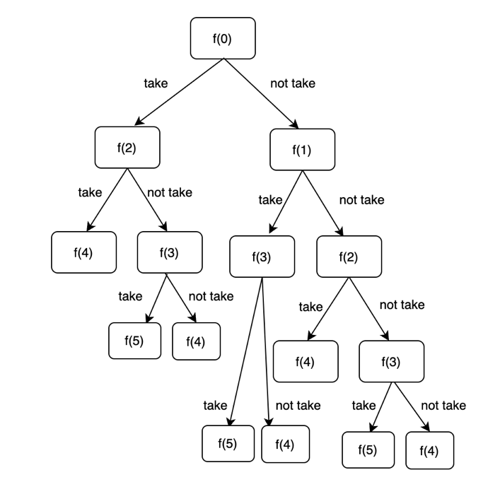
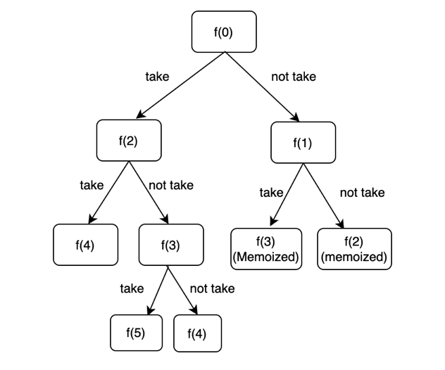

The problem for this session is Maximum Sum of Non adjacent elements (a.k.a House Robber Problem). The problem statements are: 

```
You are given an array/list of ‘N’ integers. You are supposed to return the maximum sum of the subsequence with the constraint that no two elements are adjacent in the given array/list.

Note:
A subsequence of an array/list is obtained by deleting some number of elements (can be zero) from the array/list, leaving the remaining elements in their original order.
```

```
You are a professional robber planning to rob houses along a street. Each house has a certain amount of money stashed, the only constraint stopping you from robbing each of them is that adjacent houses have security systems connected and it will automatically contact the police if two adjacent houses were broken into on the same night.

Given an integer array nums representing the amount of money of each house, return the maximum amount of money you can rob tonight without alerting the police.
```

Here are the problem links: [CodeStudio](https://www.codingninjas.com/studio/problems/maximum-sum-of-non-adjacent-elements_843261) and [LeetCode](https://leetcode.com/problems/house-robber/)


Pro Tip: **Whenever we have a question which asks us something around subsequences or subsets, recursion is a good option, as it helps us to explore all subsets**

Later on, we can check whether if we can memoize the answers to the recursive subproblems.

Let's see how we can formulate the solution to this problem recursively:

Let f(i) denote the maximum sum of non adjacent elements that is possible by considering the elements from indices i to n-1. Then, standing at index i, we have two options: either to take the element at index i, and then consider the subproblem from i+2 to n-1 (since we are not allowed to take two adjacent elements). Or, we can choose not to take the element at index i, and consider the subproblem from index i+1 to n-1. 

Here's the recursive code:

```
int help(int ind,int n,vector <int> &nums){
    if (ind>=n) return 0;
    int take = nums[ind]+help(ind+2,n,nums);
    int notTake = help(ind+1,n,nums);
    return max(take,notTake);
}
```

Let's see the recursive tree diagram for n = 4



Time Complexity: Exponential in nature, since from every state we are making two recursive calls.

Space Complexity: O(N) for recursive stack space, as there can be at maximum n recursive stack frames in the memory.

Mathematical proof for time complexity: If we formulate the problem in terms of the size, the problem is:

T(n) = T(n-1) + T(n-2) + c , solving this recurrence helps us find the time complexity.

```
For simplicity sake, let's assume T(n-1) = T(n-2)

T(n) = 2 * T(n-1) + c         ---> 1

T(n-1) = 2 * T(n-2) + c       ---> 2

Putting 2 in 1

T(n) = 4 * T(n-2) + 3 * c

Similarly, T(n) = 8 * T(n-3) + 7 * c

So the general recurrence can we written as T(n) = 2^k * T (n-k) + (2^k-1) * c

Putting k=n, we have T(n) = 2^n * T(1) + (2^n-1) * c which is

2^(n+1) + (c-1), which is exponential in nature.
```

**Memoization**

If we look at the recursive tree diagram above, we can observe that there are overlapping subproblems. Hence, we can use memoization to cache the answers to these subproblems. 

Here's the memoized code:

```
int help (int ind,vector <int> &nums,int n,vector <int> &dp){
    if (ind>=n) return 0;
    if (dp[ind]!=-1) return dp[ind];
    int take = INT_MIN;
    int notTake = INT_MIN;
    take = nums[ind] + help(ind+2,nums,n,dp);
    notTake = help(ind+1,nums,n,dp);
    return dp[ind]=max(take,notTake);
}
int rob(vector<int>& nums) {
    int n = nums.size();
    vector <int> dp(n,-1);
    return help(0,nums,n,dp);
}
```

Here's the tree diagram for the memoized code : 



Time complexity: O(N) as there are n unique dp states, and we explore every state exactly once.

Space complexity: O(N) for dp vector, and O(N) for recursive stack space as there can be a maximum of n recursive stack frames in the memory at any point of time.

**Tabulation**

As discussed in the first lecture, the memoized code can be converted to tabulation by following simple four steps. 

Here's the tabulation code:

```
int rob(vector<int>& nums) {
    int n = nums.size();
    vector <int> dp(n);
    for (int ind=n-1;ind>=0;ind--){
        int take = INT_MIN;
        int notTake = INT_MIN;
        take = nums[ind] + (ind+2<n ? dp[ind+2] : 0);
        notTake = ind+1<n ? dp[ind+1] : 0;
        dp[ind]=max(take,notTake);
    }
    return dp[0];
}
```

Time complexity: O(N) as we are using a loop with n iterations.

Space complexity: O(N) for the n sized dp vector

**Space optimization**

Let's look towards space optimization. If we carefully look at the tabulation solution above, we can see that for state ind, we require the answers to states i+1 and i+2. Hence, we can space optimize by keeping a track of these two states, instead of storing the entire dp vector.

Here's the space optimized code:

```
int rob(vector<int>& nums) {
    int n = nums.size();
    int after2=0;
    int after1=0;
    int curr=INT_MIN;
    for (int ind=n-1;ind>=0;ind--){
        int take = INT_MIN;
        int notTake = INT_MIN;
        take = nums[ind] + after2;
        notTake = after1;
        curr=max(take,notTake);
        after2=after1;
        after1=curr;
    }
    return curr;
}
```

Time complexity: O(N) as we are using a loop with n iterations

Space complexity: O(1) as we are using variables to keep track of the dp states.