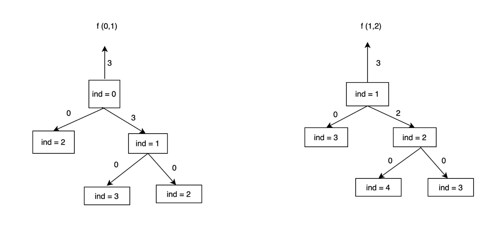

The problem that we'll be solving in this session is House Robber 2

Here's the problem link: [House Robber 2](https://leetcode.com/problems/house-robber-ii/)

Here's the problem statement : 

```
You are a professional robber planning to rob houses along a street. Each house has a certain amount of money stashed. All houses at this place are arranged in a circle. That means the first house is the neighbor of the last one. Meanwhile, adjacent houses have a security system connected, and it will automatically contact the police if two adjacent houses were broken into on the same night.

Given an integer array nums representing the amount of money of each house, return the maximum amount of money you can rob tonight without alerting the police.
```

Let's see how we can approach this problem:

We can pretty much use the same solution with some subtle changes. Notice carefully that in this problem, the array is circular, meaning that we don't want a subset which has both the extreme elements of the array. We are fine with using a subset which only has the first element of the array, only the last element of the array or neither of them. If we look at the solution for the problem House Robber 1, there's nothing that prevents both the first and last elements of the array to be included in the subset. Hence, we can make modify that solution and make two recursive calls with the following limits on indices:

1. First recursive call with the lower bound as 0 and upper bound as n-2 for the indices.

2. Second recursive call with the lower bound as 1 and upper bound as n-1 for the indices.

In both these recursive calls, the possibility of selecting both the first and last indices never arises. Hence, this solution satisfies our problem constraints.

**Recursive solution**

```
int help(int ind, int i,int j,vector <int> &nums){
    if ( ind>j ) return 0;
    int opt1 = INT_MIN;
    int opt2 = INT_MIN;
    opt1 = nums[ind]+help(ind+2,i,j,nums);
    opt2 = help(ind+1,i,j,nums);
    return max(opt1,opt2);
}
int rob(vector<int>& nums) {
    int n = nums.size();
    if (n==1) return nums[0];
    int opt1 = help(0,0,n-2,nums);
    int opt2 = help(1,1,n-1,nums);
    return max(opt1,opt2);
}
```

Here, the condition `n==1` is needed in case we have a single element only in the array, then the maximum profit equals the contents of first house.

**Tree diagrams and dry run for recursive solution**

For example test case: 

```
Input: nums = [2,3,2]
Output: 3
Explanation: You cannot rob house 1 (money = 2) and then rob house 3 (money = 2), because they are adjacent houses.
```



Time complexity: Every recursive call has exponential time complexity. Since we are making two recursive calls here, the time complexity is exponential in nature.

Space complexity: Since every recursive call takes O(N) recursive stack space (because there can be a maximum of N recursive stack frames in the memory). Over here, we are making two recursive calls, so the space complexity would still be O(N)

Proof of time complexity:

```
For simplicity sake, let's assume T(n-1) = T(n-2)

T(n) = 2 * T(n-1) + c         ---> 1

T(n-1) = 2 * T(n-2) + c       ---> 2

Putting 2 in 1

T(n) = 4 * T(n-2) + 3 * c

Similarly, T(n) = 8 * T(n-3) + 7 * c

So the general recurrence can we written as T(n) = 2^k * T (n-k) + (2^k-1) * c

Putting k=n, we have T(n) = 2^n * T(1) + (2^n-1) * c which is

2^(n+1) + (c-1), which is exponential in nature.
```

**Memoization**

If we carefully look at the tree diagrams above, we can see that there are overlapping subproblems in both the recursive calls. So, we can work on memoizing the answers to these subproblems. It's however important to note that we cannot use the same memoized values for the two recursive calls, because both of them have different limits for recursive calls. As an example, dp[i] would mean the maximum profit by considering the elements from i to n-2, whereas dp[i] would mean the maximum profit by considering the elements from indices i to n-1 . Hence, we need to use two different dp vectors for both these recursive calls.

Memoized code: 

```
int help(int ind, int i,int j,vector <int> &nums, vector <int> &dp){
    if (ind>j) return 0;
    if (dp[ind]!=-1) return dp[ind];
    int opt1 = INT_MIN;
    int opt2 = INT_MIN;
    opt1 = nums[ind]+help(ind+2,i,j,nums,dp);
    opt2 = help(ind+1,i,j,nums,dp);
    return dp[ind] = max(opt1,opt2);
}

int rob(vector<int>& nums) {
    int n = nums.size();
    if (n==1) return nums[0];
    vector <int> dp(n,-1);
    int opt1 = help(0,0,n-2,nums,dp);
    fill(begin(dp),end(dp),-1);
    int opt2 = help(1,1,n-1,nums,dp);
    return max(opt1,opt2);
}
```

Time complexity: O(N)+O(N) = O(N) , as there are n unique dp states in each recursive call.

Space complexity: O(N) for the recursive stack space as well as the dp vector which is used in both the recursive calls.

**Tabulation**

As discussed in the first lecture, we can convert the memoized code to tabulation by following simple four steps. Here's the code using tabulation approach:

```
int rob(vector<int>& nums) {
    int n = nums.size();
    if (n==1) return nums[0];
    int maxi=0;
    vector <int> dp(n);
    for (int ind = n-2; ind>=0; ind--){
        int opt1 = INT_MIN;
        int opt2 = INT_MIN;
        opt1 = nums[ind]+(ind+2 > n-2 ? 0: dp[ind+2]);
        opt2 = (ind+1 > n-2 ? 0: dp[ind+1]);
        dp[ind] = max(opt1,opt2);
    }
    maxi = max(maxi,dp[0]);
    for (int ind = n-1; ind>=1; ind--){
        int opt1 = INT_MIN;
        int opt2 = INT_MIN;
        opt1 = nums[ind]+(ind+2 > n-1 ? 0: dp[ind+2]);
        opt2 = (ind+1 > n-1 ? 0: dp[ind+1]);
        dp[ind] = max(opt1,opt2);
    }
    maxi = max(maxi,dp[1]);
    return maxi;
}
```

Time complexity: O(N) as we are using two loops with n iterations.

Space complexity: O(N) as we are using a dp vector of n size.

**Space optimization**

Let's look towards space optimization. If we carefully look at the recurrence above, we can see that the answer to state i depends only on states i+1 and i+2, hence we can store the answers to these subproblems in variables and optimize the space.

Here's the space optimized code:

```
int rob(vector<int>& nums) {
    int n = nums.size();
    if (n==1) return nums[0];
    int maxi=0;
    int after2=0;
    int after1=0;
    int curr=0;
    vector <int> dp(n);
    for (int ind = n-2; ind>=0; ind--){
        int opt1 = nums[ind]+after2;
        int opt2 = after1;
        curr = max(opt1,opt2);
        after2=after1;
        after1=curr;
    }
    maxi = max(maxi,curr);
    after2=after1=curr=0;
    for (int ind = n-1; ind>=1; ind--){
        int opt1 = nums[ind]+after2;
        int opt2 = after1;
        curr = max(opt1,opt2);
        after2=after1;
        after1=curr;
    }
    maxi = max(maxi,curr);
    return maxi;
}
```

Time complexity: O(N) as we are using two loops with n iterations each.

Space complexity: O(1) as we are only using variables to store the answers to dp states.