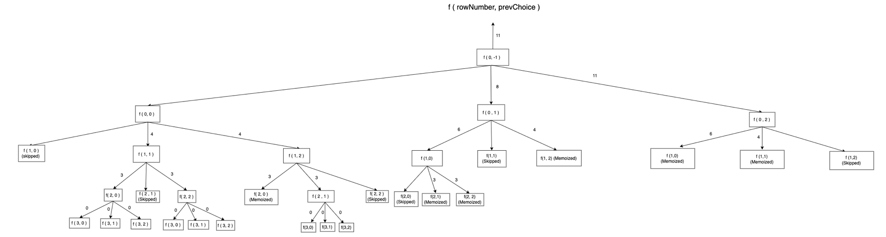

The problem that we are going to solve is: [Ninja's training](https://www.naukri.com/code360/problems/ninja%E2%80%99s-training_3621003?utm_source=striver&utm_medium=website&utm_campaign=a_zcoursetuf)

The question states that:

```
Ninja is planing this ‘N’ days-long training schedule. Each day, he can perform any one of these three activities. (Running, Fighting Practice or Learning New Moves). Each activity has some merit points on each day. As Ninja has to improve all his skills, he can’t do the same activity in two consecutive days. Can you help Ninja find out the maximum merit points Ninja can earn?

You are given a 2D array of size N*3 ‘POINTS’ with the points corresponding to each day and activity. Your task is to calculate the maximum number of merit points that Ninja can earn.

For Example
If the given ‘POINTS’ array is [[1,2,5], [3 ,1 ,1] ,[3,3,3] ],the answer will be 11 as 5 + 3 + 3.
```

**Let's see why Greedy approach won't work**

Let's say we have the input points array as [ [20,50,40], [10,100,5]], if we greedily pick 50 from the first row, then from the next row, we can only pick up 10 or 5. So, the total profit in this case would be 50+10 = 60. Let's consider another possibility: We choose 40 from the first row, and choose 100 from the next row. The total profit in this case would be 40+100 = 140, which is greater than the profit obtained earlier. Hence, greedy strategy won't work for this problem.

**Hence, since greedy fails, we need to try out all possibilities. Recursion will help us with that**

Let's see how we can approach this problem. If I am at the row `ind` of the matrix, I have the option of taking any of the three options, provided that I don't end up taking the same option which was taken in the previous row (This is not allowed according to the problem constraints). So, this problem can easily be formulated if I have two recursive parameters `ind` which indicates the row and `prevChoice` which indicates the column which was chosen in the previous row.

Here's the recursive code:

```
int help(int ind, int prevChoice,int n, vector <vector<int>> &points){
    if (ind==n) return 0;
    int maxi=INT_MIN;
    for (int i=0;i<3;i++){
        if (i==prevChoice) continue;
        int subProbAns = points[ind][i]+help(ind+1,i,n,points);
        maxi=max(maxi,subProbAns);
    }
    return maxi;
}

int ninjaTraining(int n, vector<vector<int>> &points)
{
    return help(0,-1,n,points);
}
```

Here, for the initial state, we are passing -1 as the prevChoice, since for the first row, we can choose any option out of 0,1 or 2.

**Let's see the recursive tree diagram and dry run for an example testcase**



Time complexity: Exponential in nature, since at every state, we have three possibilities, which give rise to three branches from every state. Hence, the time complexity can be stated as O(3^(n*3)) (There are total n * 3 number of states, and for every state, we are recursively exploring three different branches)

Space complexity: O(n) as there can be a maximum of n number of recursive stack frames in the memory.

**Memoization**

If we carefully look at the recursive tree digaram above, we can see that there are overlapping subproblems. Hence, we can memoize the answers to subproblems and optimize the time complexity.

Memoized code: 

```
int help(int ind, int prevChoice, int n, vector <vector<int>> &points, vector <vector<int>> &dp){
    if (ind>=n) return 0;
    if (prevChoice!=-1 && dp[ind][prevChoice]!=-1) return dp[ind][prevChoice];
    int maxi = INT_MIN;
    for (int i=0;i<3;i++){
        if (i==prevChoice) continue;
        maxi=max(maxi,points[ind][i]+help(ind+1,i,n,points,dp));
    }
    if (prevChoice!=-1) dp[ind][prevChoice]=maxi;
    return maxi;
}
int ninjaTraining(int n, vector<vector<int>> &points)
{
   vector <vector<int>> dp(n,vector <int> (3,-1));
   return help(0,-1,n,points,dp);
}
```

Time complexity of memoized solution: O(n * 3 * 3) since there are n*3 dp states, and each transitioning from one dp state to another takes a loop with 3 iterations. (We are using a for loop inside every recursive dp state)

Space complexity of memoized solution: O(n*3) for the dp matrix, and O(n) for the recursive stack space as there can be a maximum of n recursive stack frames in the memory.

**Tabulation**

As discussed in the first lecture, the memoized solution can be converted to tabulation code by following simple four steps. 

Here's the tabulated code:

```
vector <vector<int>> dp(n+1,vector <int> (3));
int prevChoice=-1;
dp[n][0]=dp[n][1]=dp[n][2]=0;
for (int ind=n-1;ind>=0;ind--){
    for (int i=0;i<3;i++){
        int maxi = INT_MIN;
        if (ind!=n-1) prevChoice = i;
        for (int j=0;j<3;j++){
            if (prevChoice==j) continue;
            maxi=max(maxi,points[ind][i]+dp[ind+1][j]);
        }
        dp[ind][i]=maxi;
    }
}
return max({dp[0][0], dp[0][1], dp[0][2]});
```

Time complexity: O( N * 3 * 3 ) as we are using three nested loops with these many iterations.

Space complexity: O (N * 3) as we are using a dp matrix with these dimensions.

**Space optimization**

Let's look towards the possibility of space optimization. If we carefully look at the tabulation code above, we can see that for any dp state with row x, we only need the answer to dp states in row x+1. Hence, we can space optimize by only storing the answers to these states, instead of storing the entire dp matrix.

```
int prevChoice=-1;
vector <int> after (3,0);
vector <int> curr (3,0);
for (int ind=n-1;ind>=0;ind--){
    for (int i=0;i<3;i++){
        int maxi = INT_MIN;
        if (ind!=n-1) prevChoice = i;
        for (int j=0;j<3;j++){
            if (prevChoice==j) continue;
            maxi=max(maxi,points[ind][i]+after[j]);
        }
        curr[i]=maxi;
    }
    after=curr;
}
return max({curr[0], curr[1], curr[2]});
```

Time complexity: O(N * 3 * 3) as we are using three nested loops with these many iterations.

Space complexity: O(2*3) which is constant as we are using two vectors with size of 3 each.